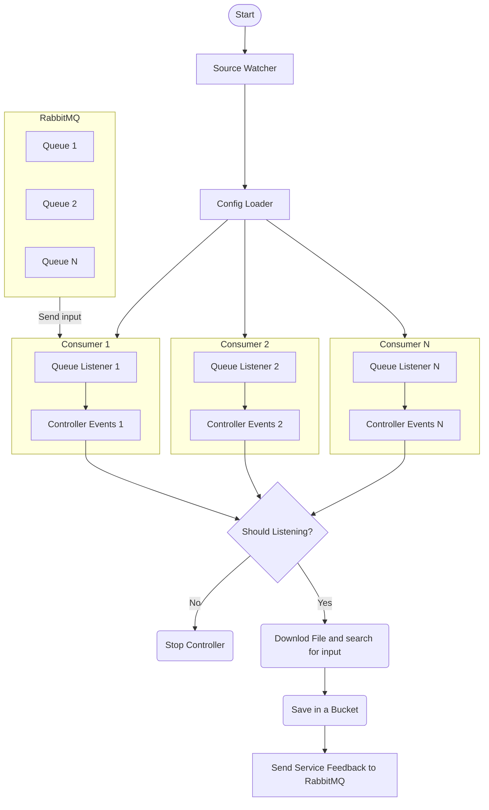

```mermaid
flowchart TB
 A([Start]) --> Service[Source Watcher]
 Service --> Config_Loader[Config Loader]

 subgraph Consumer_1[Consumer 1]
    Queue_Listener_1[Queue Listener 1]
    Controller_Events_1[Controller Events 1]
 end
 subgraph Consumer_2[Consumer 2]
    Queue_Listener_2[Queue Listener 2]
    Controller_Events_2[Controller Events 2]
 end
 subgraph Consumer_N[Consumer N]
    Queue_Listener_N[Queue Listener N]
    Controller_Events_N[Controller Events N]
 end

 subgraph RabbitMQ[RabbitMQ]
    Queue_1[Queue 1]
    Queue_2[Queue 2]
    Queue_N[Queue N]
 end

Config_Loader --> Consumer_1
Config_Loader --> Consumer_2
Config_Loader --> Consumer_N

RabbitMQ --> |Send input|Consumer_1

Queue_Listener_1 --> Controller_Events_1
Queue_Listener_2 --> Controller_Events_2
Queue_Listener_N --> Controller_Events_N

Controller_Events_1 --> Should_Listening{Should Listening?}
Controller_Events_2 --> Should_Listening{Should Listening?}
Controller_Events_N --> Should_Listening{Should Listening?}

Should_Listening --> |No|Stop_Controller(Stop Controller)
Should_Listening --> |Yes|Run_Job(Downlod File and search for input)

Run_Job --> Store(Save in a Bucket)

Store --> Publish_Feedback[Send Service Feedback to RabbitMQ]

```