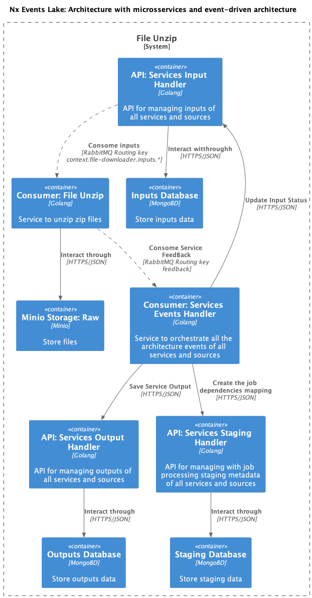

# file-unzip

`file-unzip` is a Golang-based service that performs the following tasks:

- Unzip files stored in a bucket (raw layer).
- Apply a slicer in each file inside the zip file (chunk size: 128MB)
- Store the zip file content in a bucket (raw layer).
- Publishes the bucket location to a message queue for further consumption.

## Service Components

The service consists in a simple consumer for a queue, each serving a specific purpose. Here's an overview of these components:

### Main Module

- `main.go`: The entry point of the service.
  - Creates consumer for specific queue that its bind with a regex routing key to receives all messages with the service destiny.
  - Creates Listeners that can handle with use cases approach.
  - Register all the listeners in the consumer than run the consumer.

### Consumer Module

- `file_unzip/internal/infra/consumer/consumer.go`: Contains the `RunConsumers` method responsible for starts consuming events for all Listeners registered.
  - This method listens to a RabbitMQ exchange in a goroutine, processes incoming data, and trigger the results to the listener.

### listener Module

- `file_unzip/internal/infra/consumer/listener/listener.go`: This package contains the `MessageHandlerInterface` interface, which is responsible for handling the listener dependency injection.

- `file_unzip/internal/infra/consumer/listener/service_input_listener.go`: This package is responsible to get the message in the channel unmarshal in the structure to execute an use case then dispatch the result to a rabbitMQ exchange.


### Job Handling Module

- `file_unzip/internal/usecase/unzip_file.go`: Handles the execution of jobs related to unzip and storing the file in a bucket.
  - It uses a slicer in each file to resize the file to 128MB.

## How to Run the Service

To run your service, follow these steps:

1. **Setup Configuration**:

    - Create a `.env.{ENVIRONMENT}` file based on the example provided in the `envs` folder.

2. **Build The Service**:

```sh
npx nx image services-raw-layer-file-unzip --env=<ENVIRONMENT>
```

3. **Run the Application**:

```sh
docker-compose up -d
```

## Architecture Diagram

### C4 Diagram




Please note that this README provides a high-level overview of your service's structure and components. To run the service effectively, make sure to provide the required configurations and customize the job handler logic according to your specific use case.

If you have any questions or need further assistance, feel free to ask.
