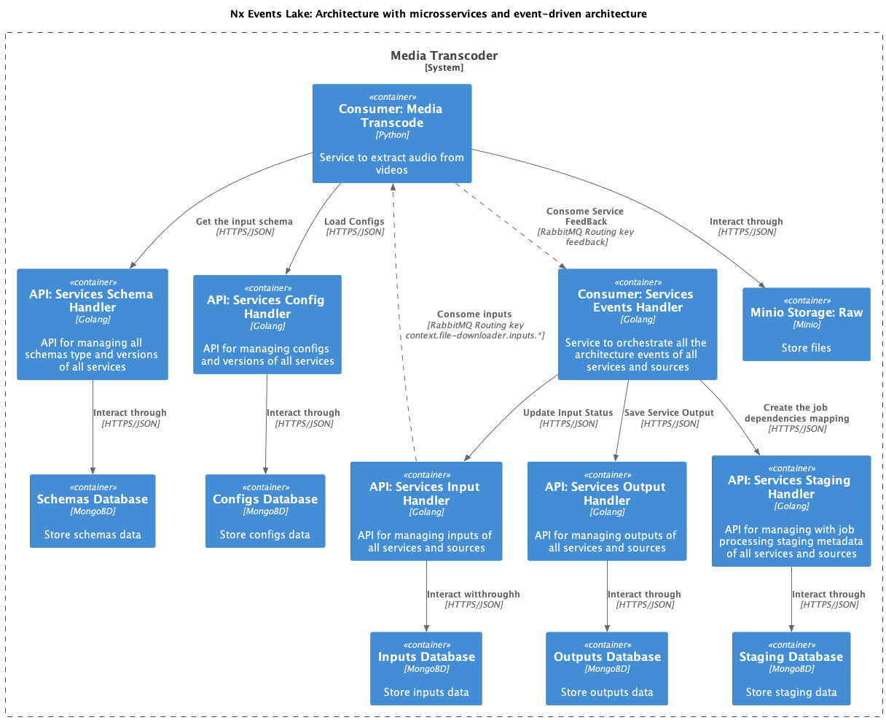
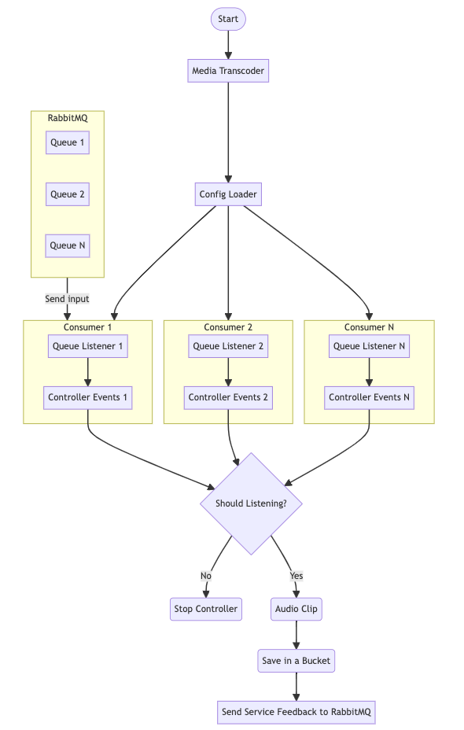

# media-transcoder

`media-transcoder` is a Python-based service that performs the following tasks:

- Extract Audio from a video of a specific source in a event approach.
- Store the Audio in a bucket (raw layer).
- Publishes the bucket location to a message queue for further consumption.

## Service Components

The service consists of multiple Python modules and classes, each serving a specific purpose. Here's an overview of these components:

### Main Module

- `main.py`: The entry point of the service.
  - It initializes various configurations, including the service name and context environment.
  - Creates consumers for specific configurations and starts processing data.
  - Each config has it owns queue consumption.

### Consumer Module

- `media_transcoder/consumer/consumer.py`: Contains the `EventConsumer` class responsible for consume an input message and trigger the callback.
  - This class listens to a RabbitMQ queue, processes incoming data, and trigger the results to the controller.

### Controller Module

- `media_transcoder/controller/controller.py`: This module contains the `EventController` class, which is responsible for handling the business logic related to event processing.

  - The `EventController` class receives the processed data from the `EventConsumer`.
  - It checks if the controller should be active based on the configuration.
  - If active, it parses and processes the data using the job handler.
  - It triggers the job dispatcher to execute the job and collect the results.
  - It publishes the results, including the storage URI, to a message queue for further consumption.

  The `EventController` class plays a crucial role in orchestrating the event-driven processing of data within the service.

This class ensures that the service processes incoming data efficiently, initiates the appropriate job handler for the task, and communicates the results to the relevant channels.

### Job Handling Module

- `media_transcoder/jobs/job_handler.py`: Handles the execution of jobs related to downloading and storing the file in a bucket.
  - It uses a specific job handler module based on the configuration.

### Job Handler Module

#### Audio Clip Handler

- `jobs/handlers/audio_clip/job.py`: An example job handler module.
  - It defines the logic for extracting the audio from a video.
  - It uploads the downloaded data to a Minio storage bucket.
  - It returns the job result, including the storage URI and status.


### Libraries Dependencies:

#### Configuration Module

- `config_loader`: Loads configurations for the service, such as the source, job handler, service parameters and job parameters also.

#### RabbitMQ Module

- `pyrabbitmq`: Handles the interaction with RabbitMQ, including creating channels, queues, and publishing messages.

#### Service Discovery Module

- `pysd`: Manages service discovery and RabbitMQ endpoints.

## Architecture Diagram

### C4 Diagram



### Service Diagram




## How to Run the Service

To run your service, follow these steps:

1. **Setup Configuration**:

    - Create a `.env.{ENVIRONMENT}` file based on the example provided in the `envs` folder.

2. **Build The Service**:

```sh
npx nx image services-raw-layer-media-transcoder --env=<ENVIRONMENT>
```

3. **Run the Application**:

```sh
docker-compose up -d
```

Please note that this README provides a high-level overview of your service's structure and components. To run the service effectively, make sure to provide the required configurations and customize the job handler logic according to your specific use case.

If you have any questions or need further assistance, feel free to ask.