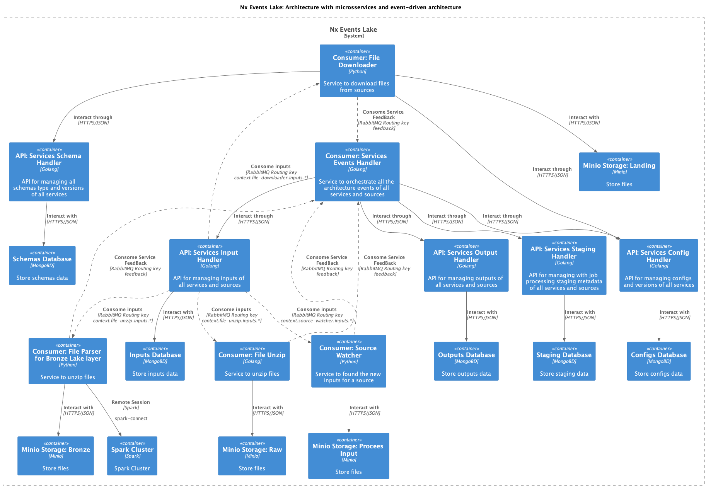

# Getting Started

Required Installations:

- [Node.js 18.x](https://nodejs.org/en/download/)
- [Golang 1.20](https://golang.google.cn/)
  - [Wire](https://pkg.go.dev/github.com/google/wire)
    ```shell
    go install github.com/google/wire/cmd/wire@latest 
    ```
- [Python 3.10](https://www.python.org/downloads/)
  - [Poetry](https://pypi.org/project/poetry/1.2.0b3/)
    ```shell
    pip install poetry==1.2.0b3
    ```
- [docker](https://www.docker.com/)
- [docker-compose](https://www.docker.com/)


## Install dependencies

```shell
npm install
```

```shell
poetry install
```

## Terminal virtual environment

```shell
poetry shell
```

## Environment Setup

1. Create Configs and Schemas:
Each service and source has it own config and schema you will need to create before run a service.

- Create a directory for the target source under the `.configs/` then create all the configs and schemas.

**Config Example:**
- File Downloader

```json
{
  "name": "ceaf-config",
  "active": true,
  "frequency": "daily",
  "service": "file-downloader",
  "source": "ceaf",
  "context": "br",
  "depends_on": [{
    "service": "source-watcher",
    "source": "ceaf"
  }],
  "service_parameters": {
    "job_handler": "default"
  },
  "job_parameters": {
    "url": "https://portaldatransparencia.gov.br/download-de-dados/ceaf/{}"
  }
}
```

**Schema Example**
- File Downloader (Schema Type: Input)
```json
{
    "schema_type": "service-input",
    "service": "file-downloader",
    "source": "ceaf",
    "context": "br",
    "json_schema": {
        "type": "object",
        "properties": {
            "documentUri": {
                "type": "string"
            },
            "partition": {
                "type": "string"
            }
        },
        "required": [
            "documentUri",
            "partition"
        ]
    }
}
```

You can check all configs and schemas example for one source [here](https://github.com/FabioCaffarello/nx-events-lake/tree/main/.configs/ceaf)

2. Make sure all the `.env.<ENVIRONMEMNT>` files for all the service are created. (each project has it own example)

3. Create Buckets and Post the configs and schemas to each API:
- Some buckets are needed for each responsibility, service and also source
- The configs created in the directory under the `.configs/` needed to be saved in the mongoDB the you need to post the configs and the schemas in each API.

To Create and to make the Post Request run the commmand:

```sh
make setup-env context=<CONTEXT> source=<SOOURCE>
```

Thats it... The source has been added to the environment then all the services can start:

```sh
make run
```
 - if get an error in the compose, run:

```sh
make reload
```
This comand will try to make the compose up again.


## Diagram




--- 
This repo was structured with a monorepo approach and optimize with NX framework.

Feel free to take a look in the [nx cloud ui of the workspace](https://cloud.nx.app/orgs/64f022fa9ef0668418db0252/workspaces/653ee969bc30e7676f89d10b/overview)

<a alt="Nx logo" href="https://nx.dev" target="_blank" rel="noreferrer"></a>

